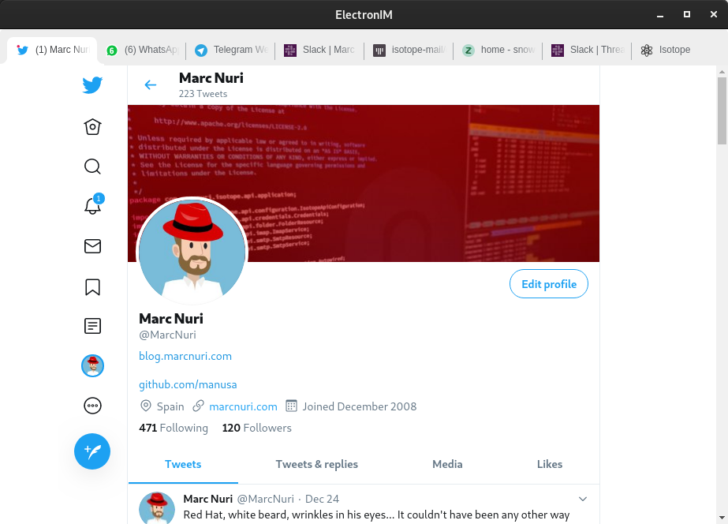

# ElectronIM Development Guide

ElectronIM is a free/libre open source Electron-based multi-instant messaging (IM) client that allows users to combine multiple messaging applications into a single browser window.

Always reference these instructions first and fallback to search or bash commands only when you encounter unexpected information that does not match the info here.

## Working Effectively

### Requirements

- **Node.js**: v22.x (LTS) or newer - [Download](https://nodejs.org/en/download/)
  Node v22, v24 and v26 all work. The floor is set by eslint 10
  (`^20.19.0 || ^22.13.0 || >=24`) and electron 44 (`>= 22.12.0`); CI uses v22.x.
  Node v26 used to leave an unusable electron install, because the `extract-zip` that
  electron's postinstall relied on stalled part way through extraction and never settled,
  so `node_modules/electron/path.txt` was never written and every suite that loads
  `src/settings/index.js` failed in `getElectronPath`. electron 44 replaced that extractor
  and the problem is gone. Note `nodehun` is a native node-gyp addon with no prebuilds, so
  it has to be rebuilt when the Node ABI changes:
  `npx node-gyp@11 rebuild --directory=node_modules/nodehun`.

### Bootstrap and Setup
Run these commands to set up the development environment:
```bash
npm install  # Install dependencies - takes ~55 seconds
```

### Build and Bundle
- `npm run pretest` - Run linting (ESLint) and build bundles (webpack) - takes ~2 seconds
- `node webpack.js` - Build webpack bundles manually - takes ~2 seconds  
- `node webpack.js --no-lib` - Build bundles without library files for development
- `npm run build:linux` - Builds and bundles the application for Linux systems
- `npm run build:mac` - Builds and bundles the application for MacOS systems
- `npm run build:win` - Builds and bundles the application for Windows systems

### Testing
- `npm test` - Run full test suite - takes ~10 seconds, runs 1221 tests (64 test suites). NEVER CANCEL - Set timeout to 30+ minutes.
- `npm run test:e2e` - Run end-to-end tests to verify application startup - takes ~10-15 seconds
- The project uses Jest with ECMAScript modules requiring the experimental VM modules flag for Node.js

### Running the Application
- `npm run prestart && npm start` - Build and run the Electron application locally (uses `dev/settings.json` and `dev/user-data` by default for development)
- `npm start -- --user-data /path/to/userdata` - Run with a custom application data directory (useful for running multiple instances)
- `npm start -- --settings-path /path/to/settings.json` - Run with a custom settings file location (useful for testing or multiple profiles)
- `npm start -- --user-data /path/to/instance1 --settings-path /path/to/instance1/settings.json` - Run with both custom user data and settings paths
- In CI/headless environments: `DISPLAY=:99 ./node_modules/.bin/electron . --no-sandbox`
- The application requires X11 display and may need sandbox disabled in CI environments
- **Global NPX usage**: `npx electronim` - Installs and runs the latest published version from npm registry
- **Multiple instances**: Use `--user-data` to run multiple instances with separate application data (profiles, cache, sessions, etc.)

### Building Platform Packages
- `npm run build:linux` - Build Linux packages (AppImage, snap, tar.gz). NEVER CANCEL - May take 30+ minutes. Set timeout to 60+ minutes.
- `npm run build:mac` - Build macOS packages (dmg, tar.gz)  
- `npm run build:win` - Build Windows packages (zip, portable exe)
- `npm run build:linux -- dir` - Build only the given electron-builder targets (e.g. `dir`, `snap`, `AppImage tar.gz`). The platform flag is the last argument of each `build:*` script so extra arguments become its targets; the `prebuild:*` hook still bundles with webpack first. Never call `electron-builder` directly, it skips that hook.
- Bundling happens only in `pretest`, `pretest:e2e`, `prestart`, `prepack` and the `prebuild:*` hooks, not on `npm install`.
- The Linux release artifacts (AppImage, tar.gz) are built in an `ubuntu:22.04` container, both in `publish.yml` and in the `Linux Build` job of `tests.yml`. nodehun is compiled on the build system and links against its glibc and libstdc++, so a build on a newer system ships a spell checker that doesn't load on older distributions. `./utils/check-glibc.sh` fails the build when a native binary needs more than Ubuntu 22.04 provides (it reads the symbol versions with `readelf`, from binutils). `tests.yml` extracts the AppImage and checks all of it, `publish.yml` checks `dist` only, because that job holds a token that can publish releases and shouldn't run the artifact it is about to upload. That token only reaches the upload steps, never `npm install`. `UBUNTU` in `utils/check-glibc.sh` names the release both jobs build on, and a test fails when the workflows' `container:` drifts from it.
- `build.linux.extraFiles` applies to every Linux target. The snap template brings its own `usr/`, so in the snap these files end up in an unused `usr_1/`, and the Copr RPM gets a copy under `/opt/electronim/usr`; both are harmless. The tar.gz is the one artifact whose `usr/share` tree a user can install, which is why the entry it ships is `build-config/electronim.package.desktop` (relative `Exec`/`Icon`) and not the RPM's `/opt/electronim` one.
- **IMPORTANT**: Build commands fail in environments with network restrictions due to Electron header downloads (node-gyp attempting to download from https://www.electronjs.org/headers). Document this limitation if builds fail with "network connectivity" errors.

## Validation

### Pre-commit Validation
Always run these commands before committing changes:
- `npm run pretest` - Validates linting and successful bundle creation
- `npm test` - Ensures all tests pass
- `npm run test:e2e` - Validates application startup (optional, for major changes)
- The CI build (`.github/workflows/tests.yml`) will fail if linting or tests fail

### Manual Testing Scenarios
After making code changes, manually validate by:
1. **Application startup**: `npm start` - Should open the main window with tabs for configured services
2. **Settings configuration**: Open settings (first launch or menu), add messaging service URLs:
   - WhatsApp Web: `https://web.whatsapp.com`
   - Telegram Web: `https://web.telegram.org`  
   - Slack: `https://slack.com/signin`
3. **Spell checker validation**: In settings, enable/disable spell check languages and test in message inputs
4. **Tab functionality**: 
   - Switch between service tabs using Ctrl+Tab or clicking tab headers
   - Reload tabs with Ctrl+R
   - Test tab reordering by dragging tab headers
5. **Keyboard shortcuts**: Test F11 (fullscreen), Ctrl+f (find), Ctrl+[1-9] (jump to tab)
6. **Notifications**: Test that messaging notifications from services appear as system notifications



### Screenshots for Visual Validation
- `docs/screenshots/main.png` - Main application interface with multiple messaging tabs
- `docs/screenshots/settings-empty.png` - Empty settings dialog on first launch  
- `docs/screenshots/settings.png` - Settings with configured services and spell check options

### Browser Testing
The project includes browser tests using JSDOM and Testing Library:
- Browser test files use `.browser.test.mjs` extension
- Settings functionality can be tested at `src/settings/__tests__/settings.browser.test.mjs`

### End-to-End Testing
The project includes E2E tests to verify the complete Electron application stack:
- E2E tests use `--no-sandbox`, `--disable-gpu`, `--remote-debugging-port=9222` flags for CI compatibility
- Tests verify application starts without crashing, creates main window, and runs for several seconds
- Window verification uses DevTools output analysis to confirm successful rendering
- Process termination uses SIGKILL due to tray icon preventing graceful SIGTERM shutdown
- **Startup E2E Tests** (`src/__tests__/startup.test.e2e.js`) - Tests actual Electron application startup by spawning the full process
- **First-time Install E2E Tests** (`src/__tests__/first-time-install.test.e2e.js`) - Tests that settings dialog appears when app starts with empty settings using `--settings-path` argument
- **About Dialog E2E Tests** (`src/__tests__/about.test.e2e.js`) - Tests About dialog functionality
- **Help Dialog E2E Tests** (`src/__tests__/help.test.e2e.js`) - Tests Help dialog functionality
- **Keyboard Shortcuts E2E Tests** (`src/__tests__/keyboard-shortcuts.test.e2e.js`) - Tests keyboard shortcuts functionality
- **Task Manager E2E Tests** (`src/__tests__/task-manager.test.e2e.js`) - Tests task manager functionality
- **Screen Sharing E2E Tests** (`src/__tests__/screen-sharing.test.e2e.js`) - Tests screen-sharing source selection

`npm run test:e2e` runs 131 tests across these 7 suites. They drive the real application, so
they catch things the unit suite cannot: **always run them when changing anything under
`src/__tests__/` or bumping `playwright`/`electron`.**

## Technical Architecture

### Key Technologies
- **Electron**: Desktop application framework
- **Preact**: Lightweight React alternative for UI components
- **Webpack**: Module bundler for creating optimized bundles
- **Jest**: Testing framework with JSDOM environment
- **Playwright**: Browser automation for end-to-end testing
- **ESLint**: Code linting with custom configuration

### Project Structure
- `src/` - Main source code
  - `main/` - Electron main process logic
  - `service-manager/` - Core service and messaging functionality
  - `settings/` - Application settings and configuration UI
  - `cli/` - Command-line argument parsing and validation
  - `about/` - About dialog and information
  - `app-menu/` - Application menu functionality
  - `assets/` - Asset files and resources
  - `base-window/` - Base window management utilities
  - `chrome-tabs/` - Tab UI components based on Chrome tabs
  - `components/` - Reusable UI components (Material Design 3 style)
  - `constants/` - Application-wide constants and configuration
  - `find-in-page/` - Find in page functionality
  - `help/` - Help dialog and documentation display
  - `http-client/` - HTTP client module for network requests
  - `spell-check/` - Spell checking functionality with multiple language support
  - `styles/` - Shared styles and theming
  - `task-manager/` - Task and metrics management
  - `tray/` - System tray integration
  - `update/` - Update checking and release management
  - `user-agent/` - User agent handling and configuration
  - `__tests__/` - Shared testing utilities and infrastructure
- `.github/` - GitHub configuration files
  - `workflows/` - CI/CD workflows
- `bundles/` - Generated webpack bundles (not committed)
- `build-config/` - Platform-specific build configurations
  - `chocolateyInstall.ps1` - [PowerShell](https://blog.marcnuri.com/tag/powershell) installation script for [Chocolatey](https://chocolatey.org/) (Windows)
  - `chocolateyUninstall.ps1` - [PowerShell](https://blog.marcnuri.com/tag/powershell) installation script for [Chocolatey](https://chocolatey.org/) (Windows)
  - `com.marcnuri.electronim.appdata.xml` - [AppStream](https://www.freedesktop.org/software/appstream/docs/) metainfo, installed in `usr/share/metainfo` of the Linux packages. The [AppImage catalog](https://appimage.github.io/) reads it, so update it whenever the README.md features change. Validate it with `appstreamcli validate-tree <application directory>`, which also checks that the desktop file it launches is installed; plain `appstreamcli validate` cannot. `utils/version-from-tag.js` stamps its `<releases>` at release time, since the version is only known then, and the RPM installs it in `%{_metainfodir}` (Linux)
  - `electronim.desktop` - Desktop entry configuration of the [Fedora COPR package](https://copr.fedorainfracloud.org/coprs/manusa/electronim), which installs to `/opt/electronim` (Linux)
  - `electronim.package.desktop` - Desktop entry installed in `usr/share/applications` of the AppImage, tar.gz and snap, because the AppStream metainfo launches it. Keep it in sync with `build.linux` of package.json, there are tests for that (Linux)
  - `electronim.nuspec` - [Chocolatey](https://chocolatey.org/) Nuspec information file (should be updated whenever the README.md is updated) (Windows)
  - `electronim.spec` - Spec file to build the [Fedora COPR package](https://copr.fedorainfracloud.org/coprs/manusa/electronim) (Linux)
  - `entitlements.mac.plist` Contains the MacOS entitlements for the application (Mac)
  - `VERIFICATION.txt` - [Chocolatey](https://chocolatey.org/) Moderation verification file (Windows)
- `dev/` - Development configuration
  - `settings.json` - Development settings file (committed for reusability, used by `npm start`)
  - `user-data/` - Development user data directory (not committed, used by `npm start`)
- `utils/` - Build and utility scripts
- `docs/` - Application documentation including setup guides and troubleshooting.
  These files are also accessible from within the application (they are bundled too).

### Important Files
- `package.json` - Dependencies and build scripts. Contains the electron-build configuration too.
- `webpack.js` - Webpack configuration and bundling logic
- `eslint.config.mjs` - ESLint configuration
- `src/index.js` - Electron main process entry point
- `bin.js` - CLI entry point for npm global installation

## Common Tasks

### The one-liner that describes the application

The same sentence is the `<summary>` of the AppStream metainfo, the `description` of package.json
(which electron-builder turns into the `Comment` of the desktop entry it generates), the
`build.snap.summary`, the `build.linux.synopsis`, the `Summary:` of `build-config/electronim.spec`
and the `Comment` of both desktop entries in `build-config`. Change them together, or stores show a
different sentence for each package. Keep it short: software centers cut it off, and Flathub asks
for 35 characters or fewer.

### Adding Dependencies
- Production dependencies: `npm install --save-exact <package>` 
- Development dependencies: `npm install --save-exact -D <package>`
- Always run `npm run pretest` after adding dependencies
- Pin dependencies to the patch version (i.e. don't reference dependencies using ~ or ^)

#### Dependencies deliberately held back

One dependency is pinned below its latest release on purpose. Check here before "fixing" it:

- **`dictionary-pt-br` (1.2.2)**. 2.0.1 adds `FORBIDDENWORD` on top of non-ASCII UTF-8 affix
  flags, which nodehun's hunspell misassociates, so common words (`casa`, `livro`, `mundo`)
  are all reported misspelled. The dictionary worker test catches this.

### Working with Settings
The settings system uses Preact components with Material Design 3 styling:
- Settings UI is at `src/settings/`
- Browser tests cover URL validation and settings persistence
- Settings include service tabs, spell check languages, and other configuration
- Custom application data directory can be specified via `--user-data` command-line argument to run multiple instances or isolate application data
- Custom settings path can be specified via `--settings-path` command-line argument for testing or multi-profile support
- The `setSettingsPath()` function in `src/settings/index.js` allows programmatic override of the default settings location

### Spell Check System
- Supports 20+ languages using dictionary packages
- Dictionary files are included as npm dependencies (dictionary-*)
- Spell checking logic in `src/spell-check/`

### Testing Guidelines

**CRITICAL: Minimize mocking as much as possible. Use real implementations and test infrastructure.**

#### Test Organization
- Tests are always located in nested `__tests__` directories next to the code they test
- Test files should follow existing patterns in `src/**/__tests__/`:
  - Global `describe` block to define the test suite: component or behavior being tested
  - Nested `describe` blocks for scenarios or behaviors being tested
  - Use `beforeEach` and `afterEach` for setup and teardown of the test environment
  - Use `test` blocks for individual test cases with descriptive names
  - Test blocks should have a single assertion or behavior being tested (the `beforeEach` can be used to perform the `act` or `when` step if needed, then the `test` block can just have the `assert` step)
  - Use `expect` assertions to validate outcomes
- Always test both valid and invalid input scenarios

#### Testing Infrastructure (Use These Instead of Mocking!)
The project provides several utilities in `src/__tests__/` to facilitate testing WITHOUT mocking:

1. **HTTP Server Testing** (`src/__tests__/http-server.js`):
   - `createTestServer(options)` - Creates a real HTTP server for testing
   - Options:
     - `port` - Port to listen on (default: 0 for random)
     - `handler` - Custom request handler function(req, res)
     - `routes` - Map of URL paths to response configurations
     - `cors` - Enable CORS headers (default: false)
   - Returns: `{server, port, url, close}`
   - **USE THIS** instead of mocking HTTP clients or axios
   - Example:
     ```javascript
     const testServer = await createTestServer({
       handler: (req, res) => {
         res.writeHead(200, {'Content-Type': 'application/json'});
         res.end(JSON.stringify({data: 'test'}));
       }
     });
     const response = await httpClient.get(testServer.url);
     await testServer.close();
     ```

2. **Electron API Utilities** (`src/__tests__/electron.js`):
   - Provides test-ready Electron API mocks
   - Use `testElectron()` helper for setting up Electron mocks in tests
   - **DO NOT** create your own Electron mocks - use these utilities

3. **Settings Testing** (`src/__tests__/settings.js`):
   - Provides utilities for testing with settings
   - Use these instead of manually mocking settings

4. **DOM Testing** (`src/__tests__/dom.mjs`):
   - Utilities for DOM manipulation in tests
   - Used for browser-based component tests

5. **User Agent Testing** (`src/__tests__/user-agent.js`):
   - Utilities for user agent testing

6. **Update Module Testing** (`src/__tests__/update.js`):
   - Utilities for testing update functionality in isolation
   - Provides helpers for mocking GitHub release checking

7. **Playwright Testing** (`src/__tests__/playwright.js`):
   - Playwright testing infrastructure for browser automation
   - Used in E2E tests for advanced browser interactions

#### Browser Component Testing
- Browser test files use `.browser.test.mjs` extension
- Use JSDOM environment for browser component tests
- Use Testing Library for DOM interaction and assertions
- Example: `src/settings/__tests__/settings.browser.test.mjs`

#### Key Testing Principles
1. **Avoid mocking whenever possible** - Use real implementations
2. **Use provided test infrastructure** - Don't reinvent testing utilities
3. **Test actual behavior** - Verify observable outcomes, not implementation details
4. **Keep tests simple and readable** - Tests should be easy to understand
5. **Don't tie tests to implementation** - Tests should survive refactoring

## Timing Expectations

- **npm install**: ~55 seconds
- **Linting and bundling** (`npm run pretest`): ~2 seconds
- **Test suite** (`npm test`): ~10 seconds (1221 tests, 64 test suites)
- **Application startup**: ~3-5 seconds
- **Platform builds**: 10-20 minutes (network dependent)

NEVER CANCEL long-running build operations. They may appear to hang but are downloading dependencies or compiling native modules.

## Troubleshooting

## Troubleshooting

### Common Issues
- **Sandbox errors**: Use `--no-sandbox` flag in headless/CI environments. Error: "SUID sandbox helper binary was found, but is not configured correctly"
- **Display errors**: Requires X11 display (`DISPLAY=:99` with Xvfb in CI). Error: "Missing X server or $DISPLAY"
- **Network build failures**: Platform builds fail with "network connectivity" errors when downloading Electron headers from electronjs.org
- **ECMAScript modules**: Always use `NODE_OPTIONS=--experimental-vm-modules` for tests. Error: "Dynamic import() is not available in the configured target environment"

### Build Failure Examples  
```
Error: node-gyp failed to rebuild 'nodehun' - network connectivity issues
Solution: Document that builds require internet access to download Electron headers
```

### Development Tips
- The application stores settings in user config directory (`~/.config/electronim` on Linux)
- Chrome DevTools can be opened within the Electron app for debugging (F12)
- Settings dialog shows on first launch to configure messaging services
- Each messaging service runs in its own webview with isolated context
- Use `npm run pretest` before every commit to catch linting and build issues early

## Platform Support

ElectronIM supports:
- **Linux**: AppImage, Snap, tar.gz packages
- **macOS**: DMG and tar.gz for both x64 and arm64
- **Windows**: ZIP, portable executable, and MSI installer

The application can aggregate services like WhatsApp Web, Telegram Web, Slack, and other web-based messaging platforms into a unified interface.

## Common Command Outputs

### Sample npm install Output
```
npm warn deprecated rimraf@3.0.2: Rimraf versions prior to v4 are no longer supported
added 825 packages, and audited 826 packages in 55s
155 packages are looking for funding
13 vulnerabilities (5 moderate, 8 high)
```

### Sample Test Output
```
Test Suites: 64 passed, 64 total
Tests:       1221 passed, 1221 total
Snapshots:   0 total
Time:        12.653 s
Coverage:    Lines: ~91% | Functions: ~74% | Branches: ~46% | Statements: ~79%
```
