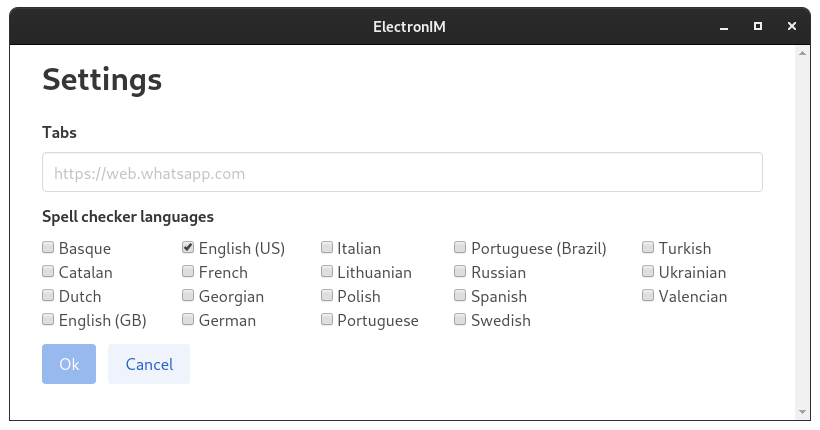
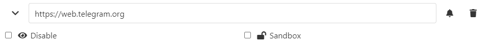
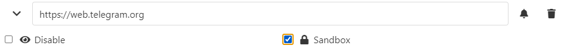

# Setup

## Install

There are several options available to install ElectronIM

### Platform packaged ElectronIM

Download the latest release for your platform from our releases page:
https://github.com/manusa/electronim/releases/latest

Extract the compressed file for your platform into a directory.
Run the appropriate executable in the extracted directory for your platform:

#### Windows

`electronim.exe`

#### MacOS

`electronim.app`

#### Linux

There are 3 options for installing and running ElectronIM in Linux:
1. Compressed tar.gz package
2. AppImage package
3. Snap package

##### Compressed tar.gz

1. Download the latest release
2. Extract the compressed files into a directory
3. Run the executable in the extracted directory

```
$ wget https://github.com/manusa/electronim/releases/latest/download/electronim-linux-x64.tar.gz
$ tar xz electronim-linux-x64.tar.gz
$ cd electronim-linux-x64
$ ./electronim
```

##### [AppImage](https://appimage.org/) package

1. Download the latest AppImage release
2. Make the AppImage executable 
3. Run the AppImage

```
$ wget https://github.com/manusa/electronim/releases/latest/download/electronim-linux-x86_64.AppImage
$ chmod a+x electronim*.AppImage
$ ./electronim-linux-x86-64.AppImage
```

##### [Snapcraft](https://snapcraft.io/electronim) package

A Snap package is available for systems with `snapd` installed.
Snapcraft is installed by default in Ubuntu, but is also available for most Linux distributions
(check Snapcraft website for the [installation guide](https://snapcraft.io/docs/installing-snapd) for your platform).

Once snapd is installed in your system, run the following command to install ElectronIM:

```
$ sudo snap install electronim
```

## Settings

The first time you open the application you'll be presented with the settings dialog
where you can add the services you'll be using:


### Settings File Location

ElectronIM follows the [XDG Base Directory Specification](https://specifications.freedesktop.org/basedir-spec/basedir-spec-latest.html) for storing configuration files:

- **New installations**: Settings are stored in `$XDG_CONFIG_HOME/electronim/settings.json` (or `~/.config/electronim/settings.json` if `XDG_CONFIG_HOME` is not set)
- **Legacy installations**: If you have existing settings in `~/.electronim/`, ElectronIM will continue using that directory for backward compatibility

To customize the settings location, you can:
- Set the `XDG_CONFIG_HOME` environment variable (e.g., `export XDG_CONFIG_HOME=/custom/config`)
- Use the `--settings-path` command-line argument (e.g., `electronim --settings-path /path/to/settings.json`)

Insert a valid URL into the empty text-field and press enter to add the new entry.

Repeat this process for each service you want to add.

Finally press **Ok** to confirm your settings, the application will reload with the added services.


### Spell checker

Select the applicable check-boxes to enable the spell checker for the selected languages.

### Sandboxing

Sandboxing provides service isolation or multi-account support:

When the checkbox is unchecked, the same context will be shared across all of the tabs (i.e. you only need to log in once for any providers which provide multiple services: GMail, Google Chat, etc.)




When the checkbox is checked, a separate isolated context will be created for that specific tab, so you can open one or more tabs for the same application with different accounts (multi-account).




