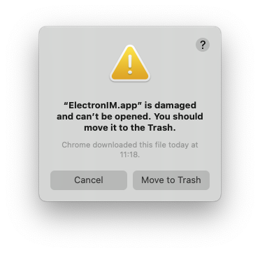
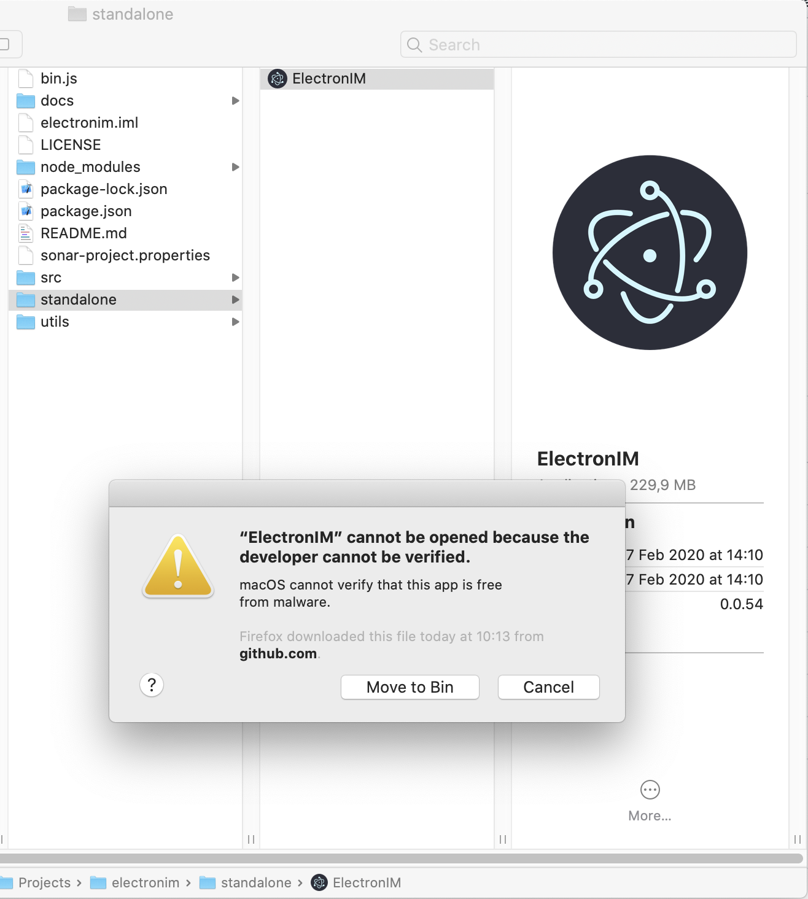
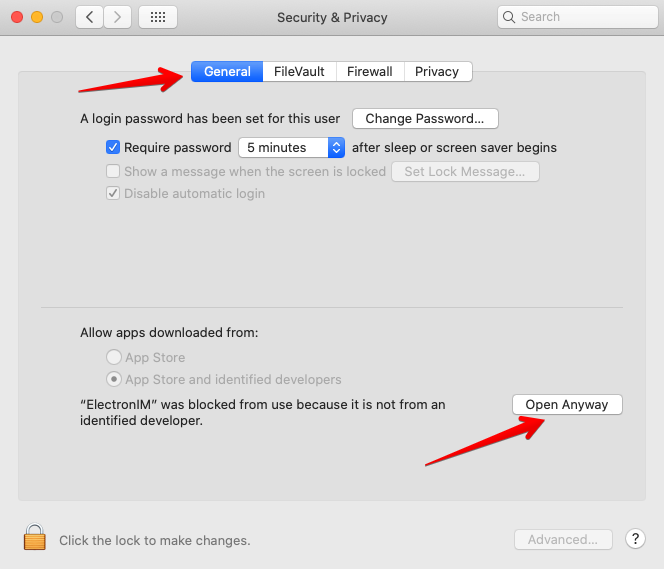

# Troubleshooting

This section contains information to help you troubleshoot frequent issues when using ElectronIM.

## MacOS / OSX

### I installed the DMG file, but the application does not run because it says it's damaged and can't be opened. What should I do?

> "ElectronIM.app" is damaged and can't be opened. You should move it to the Trash.




Since the application is not signed by a trusted developer (requires an [annual fee](https://developer.apple.com/support/compare-memberships/) to Apple), macOS may think that the application is damaged, and refuse to open it.

If and only if you trust entirely the application and the source you downloaded it from, you can do this:

 - Open a terminal window (Applications > Utilities > Terminal)
 
 - Type the following command, and press enter:
 
   ```bash
   xattr -cr /Applications/ElectronIM.app
   ```
 
 - Now try to open the application again.

### I downloaded the standalone application, and executed it, but it does not run because of unknown origin or developer. What should I do?

> "ElectronIM" cannot be opened because the developer cannot be verified. macOS cannot verify that this app is free from malware [...]



Apple only trusts in those developers who pay money to be trusted. You shouldn't trust in those who only trust in people that pay money for their trust to be earned... just saying.

In order to make ElectronIM work in macOS you can do this:

 - **Verify that you trust entirely in the application**. This project is open source, and it's maintained and curated by its author and the community. Nonetheless, security is something really important these days, it should not be overlooked, and we encourage users to actively keep an eye on what they use. ElectronIM is not an exception.
 
 - Go to the top bar menu, and click on the apple icon (Apple menu)
 
 - Select **System Preferences**


 - In the window that appears, select **Security & Privacy**
 
 - Inside the new window, select the tab **General**. The bottom contents of the window should display a message stating that the application has been blocked, and a button to let the [admin] user open it:



 - Click on the button (it will ask for credentials).
 
